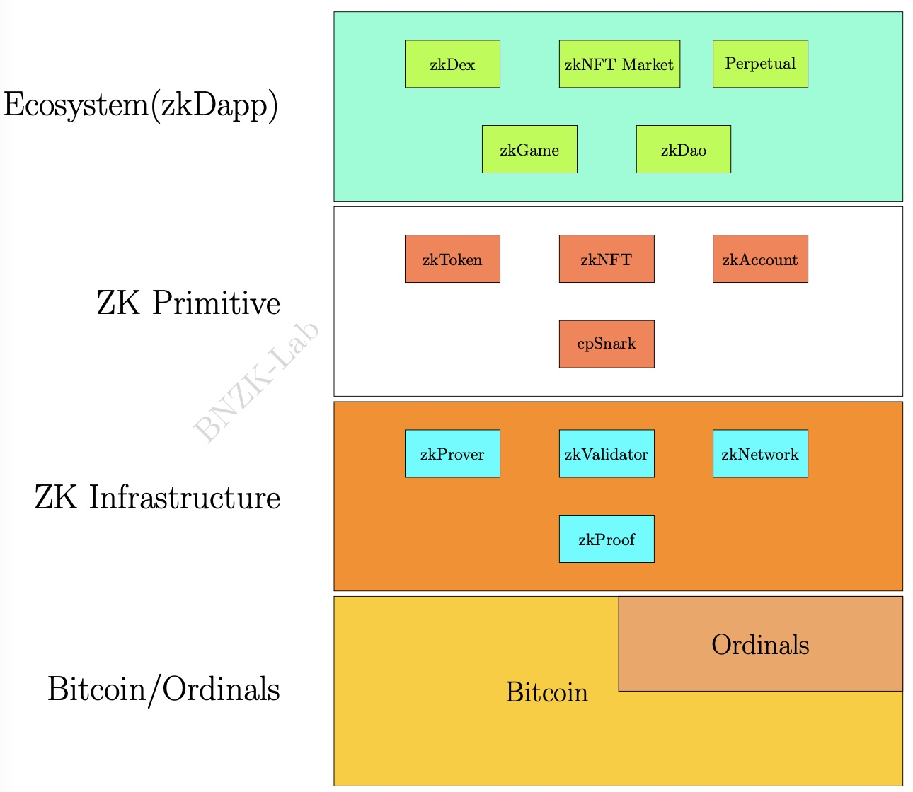

# What is Bnzk?

## Vision

Bnzk Labs aims to integrate **Zero-Knowledge (ZK) Proof** technology into the Bitcoin ecosystem in a BTC Native Manner. ZK-proofs are cryptographic techniques that allow one party to prove something to another without revealing additional information. Bnzk uses ZK-proofs to address decentralization and verifiability issues of existing Bitcoin protocols such as ordinals.

### Key Problems

Ordinals are protocols that enable complex data store on Bitcoin by incorporating protocol metadata into transactions. For example, BRC20 and ORC20 allow users to create and transfer tokens on Bitcoin.

However, due to Bitcoin's limited scripting language, the verification of ordinals transactions needs to be done off-chain by trusted parties. This introduces centralization, scalability, and security risks for users and developers.

### Solutions

Bnzk solves this problem by validating ordinals transactions off-chain and generating on-chain ZK-proof. A ZK-proof is a compact piece of data that can be verified by anyone on the Bitcoin blockchain without requiring the full transaction data. This way, Bnzk enables decentralized validation of ordinals transactions, while minimizing the data stored on Bitcoin and reducing the transaction fees.

### Technology

Bnzk leverages state-of-the-art ZK technologies such as ZK-Rollup, recursive proofs, and dedicated rollups. ZK-Rollup is a layer-2 scaling solution that aggregates multiple ordinals transactions into a single Bitcoin transaction with a ZK-proof. Recursive proofs are a technique that allows ZK-provers and ZK-validators to generate and verify ZK-proofs efficiently and securely. Dedicated rollups are a design that allows Bnzk to support different ordinals protocols such as BRC20, BRC721, and ORC20 with separate state roots and economic incentives.

<figure><figcaption></figcaption></figure>


Learn more about ZK Proof

