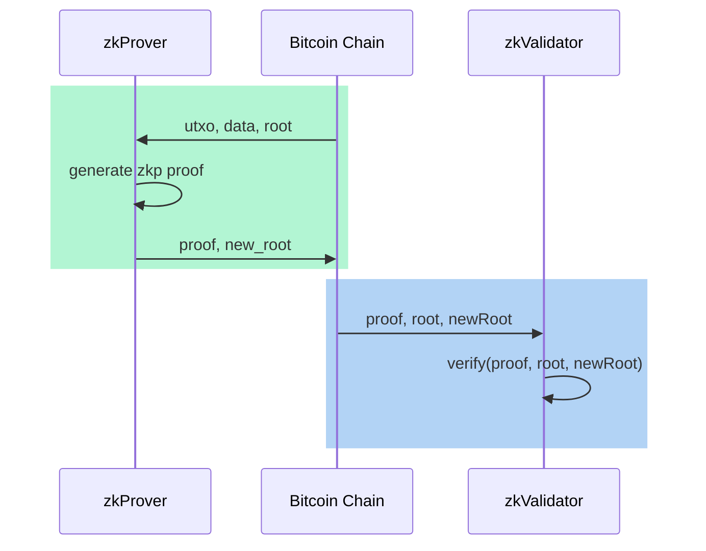
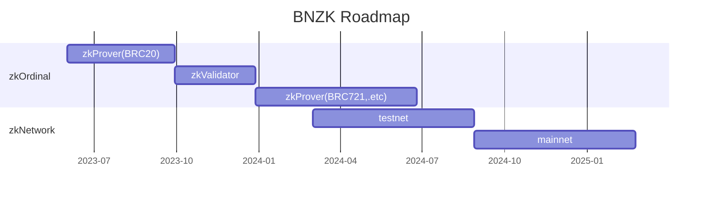

# Bnzk : zk empowers decentralized protocols for Bitcoin Native ecosystem.

## Keywords :
* Bitcoin Native
* Decentralize
* Zero-knowledge proof

## Vision

Bnzk-labs aims to integrate zero-knowledge proof technology into the Bitcoin ecosystem in a BTC Native manner, to address the decentralization and verifiability issues of existing BTC ecosystem protocols such as ordinals.

## Bitcoin Native

Bitcoin enables programming through the use of [script](https://en.bitcoin.it/wiki/Script)


Script is a very simple and limited programming language on BTC. Its security-centric design forbids complicated and unanalyzable operations to be executed on Bitcoin blockchain. As a result, Turing completeness is not achievable with Script, as loops are disallowed. Starting from version 0.3.5, even the multiplication instruction (MUL) has been removed for security reasons, which is why it is not considered Turing complete.


This deliberate and cautious design has made Bitcoin remarkably secure and stable since its inception. Bitcoin has not experienced any security vulnerabilities leading to hard forks (unlike Ethereum's ETC fork), which has further solidified its strongest consensus.


Therefore, we consider BTC Native to be of utmost importance, and the design always adheres to this principle, thus don’t affect any original use of Bitcoin.


## Decentralized

Bitcoin is limited in its ability to execute complex smart contracts, thus unable to implement certain complex business logic.

The [Ordinals protocol]((https://docs.ordinals.com/guides/inscriptions.html)) offers an innovative approach by incorporating protocol metadata into transactions. for example, the BRC20 metadata looks like,
```json
    { 
        "p": "brc-20",    //Protocol: offchain system will recognize brc-20 event
        "op": "deploy",   //op: event type (Deploy, Mint, Transfer)
        "tick": "ordi",   //Ticker: brc-20 token id
        "max": "21000000",//Max supply
        "lim": "1000"     //Mint limit
    }
```

Specifically, the Inscription content is serialized using data pushes within unexecuted conditionals, referred to as "envelopes." This approach enables BTC to be utilized as Data Availability (DA).

```shell=
OP_FALSE
OP_IF
  OP_PUSH "ord"
  OP_1
  OP_PUSH "text/plain;charset=utf-8"
  OP_0
  OP_PUSH "Hello, world!"
OP_ENDIF
```

The corresponding ordi encode data is like,


Indeed, the transaction's Inscription data and the UTXO transaction itself form the witness for the Ordinals protocol. However, due to Bitcoin's inability to execute smart contract verification, the parsing of protocol witness data needs to be done off-chain. Ordinals wrapper provides an [ordi utility](https://docs.ordinals.com/guides/inscriptions.html) based on the Bitcoin Core wallet, allowing users to create inscriptions and exercise SAT control.

This approach is centralized. To validate the proper execution of the protocol, users are required to set up a Bitcoin full node and build a complete Ordinals database. This process is not easy and requires technical expertise.

Bnzk solves this problem by inspects each Bitcoin transaction and generates zero-knowledge proof recursively. Since ZK Circuit is open source, Everyone can verify the proof.

## Zero knowledge proof

we use state-of-the-art Zero-Knowledge proof to prevent malicious activity, In brief, ZK technology employs mathematical methods to create a trusted computing environment.

prove state : $\pi_i=Prove(data_i, utxo_i, root, newRoot))$

verify stage : $Verify(\pi_i, root, newRoot)==true$



A simple zk circuit pseudocode is like

```cpp=

include "@circomlib/circuits/poseidon.circom";

template zkOrdinals() {
    signal input data;
    signal input utxo;
    signal input root;
    signal output new_root;

    // check utxo...
    
    // check on-chain data(inscription)
        
    // BRC20/BRC721 Protocol...
    
    // compute new root
    component poseidon = Poseidon(3);
    poseidon.inputs[0] <== root;
    poseidon.inputs[1] <== data;
    poseidon.inputs[2] <== utxo;
    new_root <== poseidon.out;

}

component main {public [root, new_root]} = zkOrdinals();

```

## Protocol

zero knowledge prove is now protocol specific, Our plan is to first support the ordinals BRC20 protocol(zkToken), followed by BRC721(zkNFT) and other protocols, The dedicated design will be open-sourced soon.


### zkToken(Soon)

The goal is prove ownership change with UTXO transfer.

### zkNFT(Soon)


## zkProver


By offering Prover proof services utilizing recursive proofs, the protocol can retain the state root while minimizing the amount of witness data. This approach reduces the burden on users and simplifies the verification process.

zero-knowledge proof (zk proof) will be published to the Bitcoin blockchain Periodically, anyone can download the proof and verify it either with validator service(zkValidator) or on the blockchain(zkNetwork).

## zkValidator

Multi protocol zkProver can benefit from the same zkValidator framework.

The recursive proof design makes the prove and verification simpler and more efficient.

Dedicated economic incentive mechanisms is designed to ensure that proofs are verified correctly in a decentralized way.


## zkNetwork

A modular blockchain to furthermore decentralize the zkValidator Service, using BTC as the data availablity layer.


## Roadmap:

* zkOrdinal protocol : zkToken/zkNFT Prover
* zkValidator network
* zkNetwork




