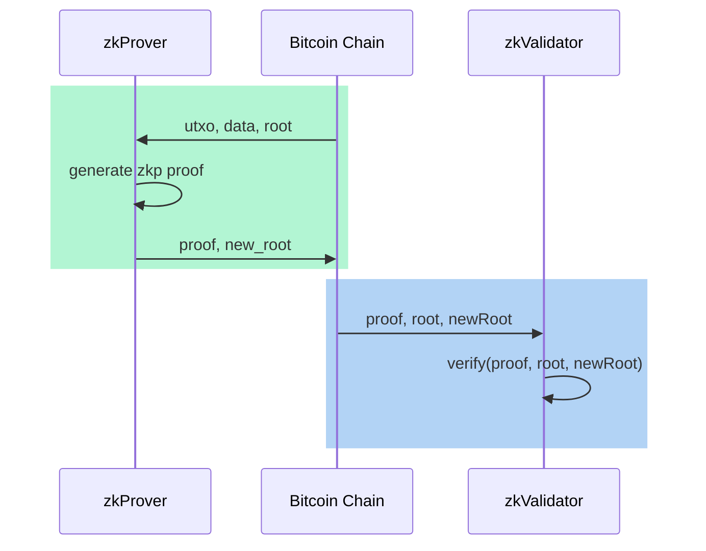

# Bizk : zk empowers decentralized protocols for Bitcoin Native ecosystem.

## Keywords :
* Bitcoin Native
* Zero-knowledge proof
* Decentralize

## Vision

BIZK aims to integrate zero-knowledge proof technology into the Bitcoin ecosystem in a BTC Native manner, to address the decentralization and verifiability issues of existing BTC ecosystem protocols such as ordinals.

## Bitcoin Native

Bitcoin enables programming through the use of [script](https://en.bitcoin.it/wiki/Script)


Script is a very simple and limited programming language on BTC. Its security-centric design forbids complicated and unanalyzable operations to be executed on Bitcoin blockchain. As a result, Turing completeness is not achievable with Script, as loops are disallowed. Starting from version 0.3.5, even the multiplication instruction (MUL) has been removed for security reasons, which is why it is not considered Turing complete.


This deliberate and cautious design has made Bitcoin remarkably secure and stable since its inception. Bitcoin has not experienced any security vulnerabilities leading to hard forks (unlike Ethereum's ETC fork), which has further solidified its strongest consensus.


Therefore, we consider BTC Native to be of utmost importance, and the design always adheres to this principle, thus don’t affect any original use of Bitcoin.


## Decentralized


The non-Turing complete nature of BTC prevents the execution of smart contracts directly on the blockchain.

The [Ordinals protocol]((https://docs.ordinals.com/guides/inscriptions.html)) offers an innovative approach by incorporating protocol metadata into transactions. for example, the BRC20 metadata looks like,
```json
    { 
        "p": "brc-20",    //Protocol: offchain system will recognize brc-20 event
        "op": "deploy",   //op: event type (Deploy, Mint, Transfer)
        "tick": "ordi",   //Ticker: brc-20 token id
        "max": "21000000",//Max supply
        "lim": "1000"     //Mint limit
    }
```

Specifically, the Inscription content is serialized using data pushes within unexecuted conditionals, referred to as "envelopes." This approach enables BTC to be utilized as Data Availability (DA).

```shell=
OP_FALSE
OP_IF
  OP_PUSH "ord"
  OP_1
  OP_PUSH "text/plain;charset=utf-8"
  OP_0
  OP_PUSH "Hello, world!"
OP_ENDIF
```

Indeed, the transaction's Inscription data and the UTXO transaction itself form the witness for the Ordinals protocol. However, due to Bitcoin's inability to execute smart contract verification, the parsing of protocol witness data needs to be done off-chain. Ordinals wrapper provides an [ordi utility](https://docs.ordinals.com/guides/inscriptions.html) based on the Bitcoin Core wallet, allowing users to create inscriptions and exercise SAT control.

This approach is very centralized. To validate the proper execution of the protocol, users are required to set up a Bitcoin full node and build a complete Ordinals database. This process is not easy and requires technical expertise.

BIZK solves this problem by inspects each Bitcoin transaction and generates a zero-knowledge proof. Since ZK Circuit is open source, Everyone can verify the proof.

## Zero knowledge proof

we use state-of-the-art Zero-Knowledge proof to prevent malicious activity, In brief, ZK technology employs mathematical methods to create a trusted computing environment.

prove state : $\pi_i=Prove(data_i, utxo_i, root, newRoot))$

verify stage : $Verify(\pi_i, root, newRoot)==true$



A simple zk circuit pseudocode is like

```cpp=

include "@circomlib/circuits/poseidon.circom";

template zkOrdinals() {
    signal input data;
    signal input utxo;
    signal input root;
    signal output new_root;

    // check utxo correct match on-chain data
    ...
        
    // check BRC20/BRC721...
    
    // compute new root
    component poseidon = Poseidon(3);
    poseidon.inputs[0] <== root;
    poseidon.inputs[1] <== data;
    poseidon.inputs[2] <== utxo;
    new_root <== poseidon.out;

}

component main {public [root, new_root]} = zkOrdinals();

```

## Protocol

TODO


Include a set of Bitcoin zk-rollup protocol, like zkToken(BRC20), zkNFT(BRC721)...

### zkToken(BRC20)

TODO

Many utxo transactions in 1 block.
Many inscribles, like brc20 json, in 1 block

How to prove ownership :  map the utxo to inscrible(json)  


### zkNFT(BRC20)

TODO


## zkProver


By offering Prover proof services utilizing recursive proofs (similar to Mina), the protocol can retain the state root while minimizing the amount of witness data. This approach reduces the burden on users and simplifies the verification process.

publish our zero-knowledge proof (zk proof) on the Bitcoin blockchain Periodically.

anyone can download the proof and verify it either validator service(zkValidator) or on the blockchain(zkNetwork).

## zkValidator

a dedicated economic incentive mechanisms is designed to ensure that proofs are generated and verified correctly.


## zkNetwork

We plan to build a modular blockchain to furthermore decentralize the zkValidator Service, using BTC as the data availablity layer.


## Roadmap:

* zkOrdinal protocol : zkToken/zkNFT Prover
* zkValidator network
* zkNetwork


## TODO 

* zkToken/zkNFT protocol
* JS SDK doc
* state-of-the-art recursive aggregation zk proof system(plonky2, gsnark..) reduce the complexicity of verify proof. Let's say, if the verify could be reduce to sha256(msg)== hash, then the proof can be verify with bitcoin sha256 op. keep in mind, xxx
* recursive proof(mina)
* Privacy
* zkBVM


