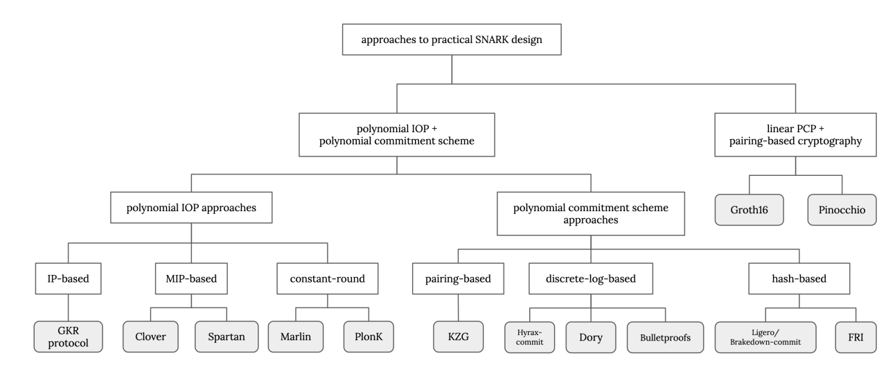

BNZK Trusted Setup : the 1st ZK Ceremony for Bitcoin Ecosystem

# What is a trusted setup?

BNZK-Lab use zk-proof as the basis of bitcoin native zk ecosystem. The underline  technology is a ZK-SNARK, namely [Groth16](https://eprint.iacr.org/2016/260.pdf), it is based on two pieces of public  cryptography infrastructure: a prover key and a verifier key. The trusted setup is a process for generating these keys in a security way.

Briefly speaking, The generation of prover and verifier key is performed via a multi-party computation (MPC) that allows us to distribute the randomness entropy across all the participants.

As long as one party in the ceremony behaves honestly and is not compromised, the entire setup is trustworthy. The more participants there are, the lower probability of do evil.

# Growth16

BNZK-Lab use both groth16 and plonk proving system, growth16 for client application and single proof generation, while plonk for server side proof aggregation.

Groth16 is defined over a bilinear pairing of elliptic curves $e : G1 × G2 → Gτ$ with scalar field $Fr$. Let $ϕ ∈ {F_r}^ℓ$ denote the set of $public \ inputs$, $w ∈ {F_r}^{m−ℓ}$ the set of $witnesses$, whose knowledge we want to prove, and let $τ ∈ ({F_r}^∗)^4$ be a set of randomly generated numbers known as the $simulation \ trapdoor$. Groth16 consists of four parts :
* $(σ, τ ) ← Setup$: Randomly generates $τ$ , from which it computes $σ$, which consists of elliptic curve points in $G1$ and $G2$. $σ$ consists of the proving and verifying keys for Groth16.
* $π ← Prove(σ, ϕ, w)$: Computes a proof of knowledge of $w$, $π$, for a given setup $σ$ and public input $ϕ$.
* $0, 1 ← Verify(σ, ϕ, π)$: Checks whether the proof $π$ is valid against the setup $σ$ and the public input $ϕ$.
* $π ← Sim(τ, ϕ)$: Simulates a proof that will always be valid when verified against the setup $σ$ corresponding to $τ$ and the public input $ϕ$.

It is important to note that the Sim function is what makes the Groth16 protocol zero-knowledge: you can compute a valid proof $π$ for any given setup $σ$ and public input $ϕ$ without knowledge of the witness $w$, provided that you have access to the simulation trapdoor $τ$ . But $Sim$ also points to a potential insecurity: if a malicious agent knew $τ$ for a given $σ$, they could fabricate valid proofs for any witness, regardless of its veracity.

The goal of the trusted setup is to compute $σ$ in a secure way, i.e., in such a way that nobody has access to the trapdoor $τ$ that was used to compute it.

# Ceremony

There is a coordinator and multiple participants. The ceremony takes place in consecutive rounds, where each participant performs one or more rounds at a time. The order in which the participants take their turns is determined by the coordinator. The number of rounds can be unlimited.

To depict this procedure, let's consider a situation involving a Coordinator, two participants named Alice and Bob, and Charlie, who is the author of a zk-SNARK project:

1. The Coordinator generates challenge_0 and makes it publicly available.
2. Alice generates response_1 and publishes it.
3. The Coordinator generates challenge_1 and announces it.
4. Bob generates response_2 and publishes it.
5. The Coordinator generates challenge_2 and makes it public.
6. Charlie utilizes the random beacon to incorporate challenge_2 into the final setup.

The resulting public transcript should contain:

1. challenge_0
2. response_1
3. challenge_1
4. response_2
5. challenge_2
6. The random beacon
7. The final parameters

Fortunately, we don't have to build from scratch. There are some reliable works :
* [Zcash power of tau ceremony](https://zfnd.org/conclusion-of-the-powers-of-tau-ceremony/)
* [iden3 phase2ceremony](https://github.com/iden3/phase2ceremony)
* [PSE perpetual powersoftau](https://github.com/weijiekoh/perpetualpowersoftau)
* [Matter Lab's Powers of Tau repository](https://github.com/matter-labs/powersoftau)

generation of prover/verifier keys for Groth16 ZKPs can be divided into two steps, or "phases." Phase 1 is multi-purpose, it results in a set of parameters that can be used by any ZKP Projects. Phase 2 is specific to the circuits being used, in our case, the BNZK zkProver circuits. The Phase 2 ceremony must be performed individually by each project and must be repeated if the project ever makes changes to their circuits.

# Phase-1 : General Purpose Ceremony

There are several public good product for phase-1 ceremony，we can resue directly. At the same time, It's worth to start a ceremony to involve more membership in the most decentralized community. The problem is, setup sequentially in 1 participant takes more than 24 hours (download/upload images more than 1G, large scale computing), a fully setup may take several months to complete.

For build quicky, BNZK chose to use the [Perpetual Powers of Tau (PPoT)]((https://github.com/weijiekoh/perpetualpowersoftau)) as our initlized Phase 1 Setup. PPoT is a public good organized by Ethereum Foundation Privacy and Scaling Explorations Team. It is an ambitious public good project to provide the community with a humongous parameter set that is big enough to accommodate very large ZKPs.

We will consider to setup a phase-1 ceremony for bitcoin ecosystem, according to community request.

# Phase-2 : circuit-specific Ceremony

BNZK specific phase-2 ceremony will start before launch mainnet, the goal is involve as many participant as possible. Before that, a testnet stage will be launch to make sure everything works as expected.

